# C compiler


## 目标

+ 将c语言转成python语言
+ 将c语言转成mips语言


## 1. 词法阶段LA

> 利用flex词法解析器进行词法解析

### 1.1 工具

1. flex
2. re

#### 1.1.1 flex

+ flex

+ https://www.ibm.com/developerworks/cn/linux/sdk/lex/ 

  


#### 1.1.2. Regular Expressions


### 1.2 核心内容

+ Thompson's algorithem
+ Subset construction
+ Brzozowski algebraic method


### 1.3 与语法解析阶段的交互


> flex 通过每次call `yylex()` 函数进行**一个**词法单元的匹配,返回一个`token`,`yylval`这个全局变量保存这value属性值,`yytext`保存了匹配的词


### 1.4 input ＆ output

+ input: 源程序

+ output: :question: :ballot_box_with_check:

  > 具体是什么 还没有确定
  >
  > 解决: token<class,string>,eg:<Id,"foo">,<Op,"=">


### 1.5 主要工作

+ 写正则表达式


##### 开始

> 使用正则表达式测试工具编写RE 
>
>  https://www.sojson.com/regex/ 

##### c语言-class type

1. 标识符 `[_a-zA-Z][_a-zA-Z0-9]*`
2. 关键字 
3. 括号
4. 操作符
   1. 计算
      1. `+` 
      2. `-`
      3. `*`
      4. `/`
      5. `%`
      6. `++`
      7. `--`
   2. 比较
      1. `==`
      2. `>=`
      3. `<=`
      4. `>`
      5. `<`
   3. 连带
      1. `+=`
      2. `-=`
      3. `/=`
      4. `*=`
5. 注释 `/\*.*\*/`
6. 整数 `[-]?[1-9][0-9]*`
   1. 带后缀的 `[-]?[1-9][0-9]*[lLuU]*`
7. 浮点数 `[-]?[1-9]+[0-9]*\.[0-9]+`
   1. 带后缀的 `[-]?[1-9]+[0-9]*\.[0-9]+[f]?`
8. 字符 `['][.]+[']`
9. 字符串字面量 `".*"`
10. 按位操作
    1. `|`
    2. `&`
    3. `^`
    4. `~`
    5. `<<`
    6. `>>`
11. 特殊字符
    1. `->`
    2. `?`
    3. `;`
    4. `.`
    5. `,`
    6. `:`

> **表达式的产生式的由来**

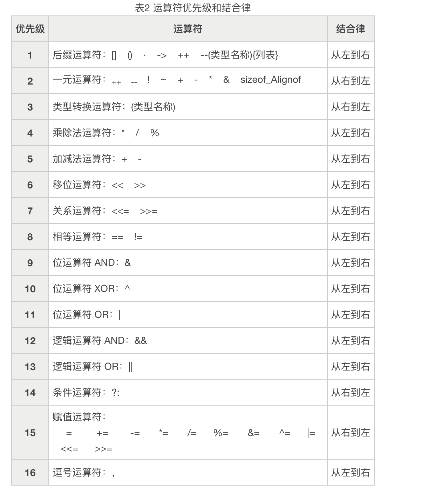


#### 1.6 工作流

##### 匹配阶段


##### 处理阶段


## 2. 语法解析阶段Parsing

### 工具

#### Yacc

+  https://www.ibm.com/developerworks/cn/linux/sdk/lex/ 


### 语法树

+ 终结符terminal
+ 非终结符 non-terminal


### 主要工作

+ 编写产生式


## 3. 代码生成阶段 Code generation


## MIPS


### 函数调用


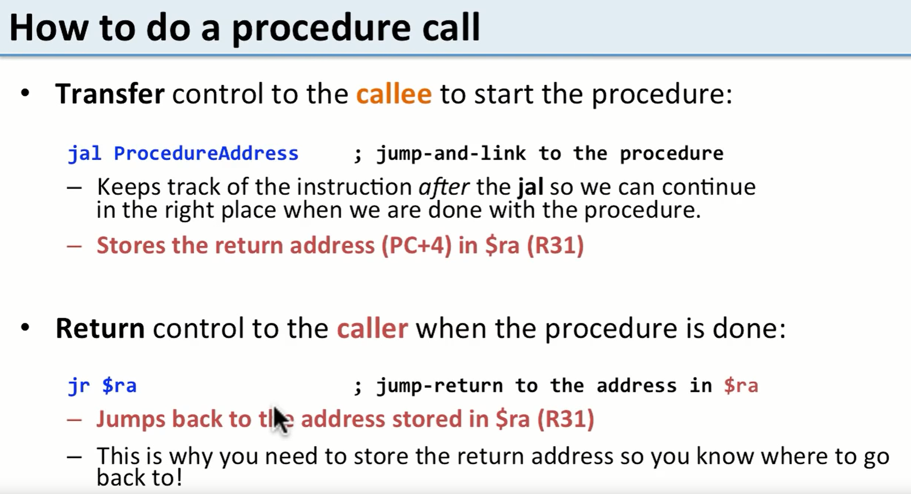


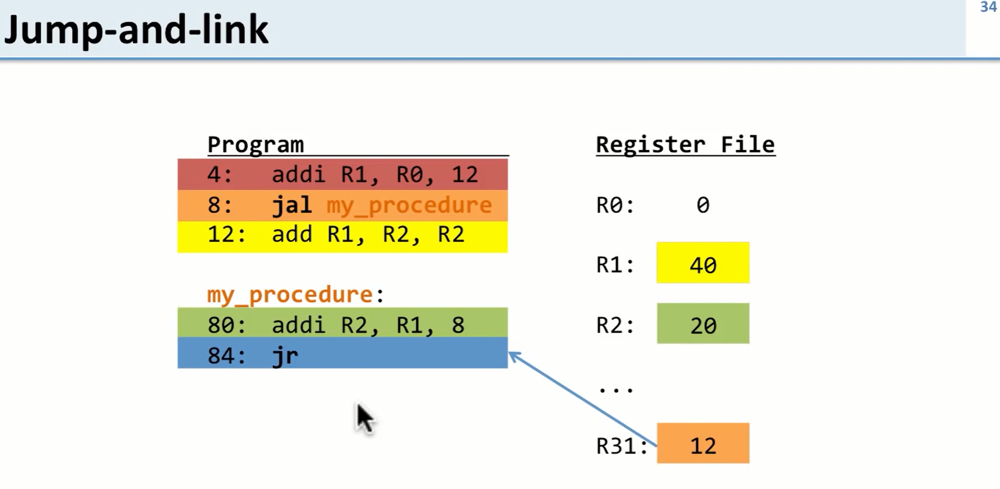

> R31 实际上是保存了PC值也就是函数调用的下一条语句的地址
>
> 函数返回实际上是将PC值返回--> 已经将数据写到了寄存器中
>
> 


#### 过程

#####  问题

> 函数调用要解决问题:
>
> 1. 如果只是使用一组寄存器来保存变量值,那么会发生寄存器值不够用,被多个函数调用进行修改

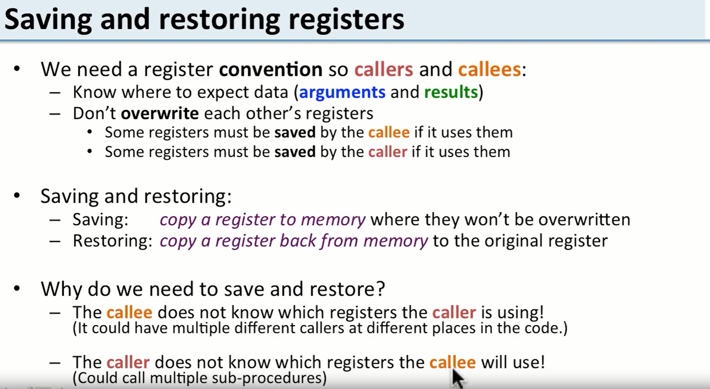


##### 解决

> 解决:
>
> 运行时stack 和 寄存器
>
> 寄存器用于保存函数调用时的环境
>
> 运行时stack保存用于存储函数调用中用到的寄存器的值


##### 谁保存什么


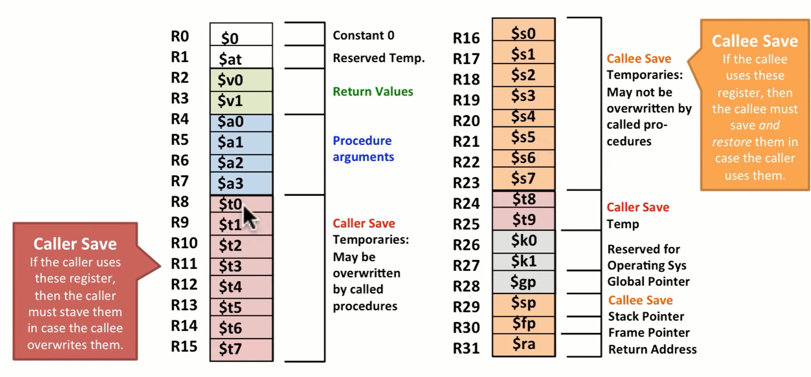


##### 怎么将寄存器的值保存到stack中

```mips
addi $sp,$sp,-4 # stack的指针下移一个字(4byte)
sw R16,$sp      # store a word 将R16寄存器的值 存储到sp指向的地址
```

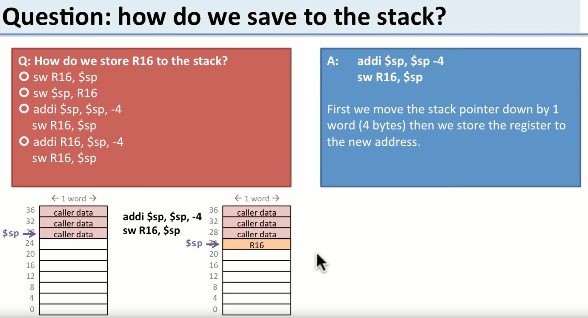


##### 怎么将stack的值恢复到寄存器中

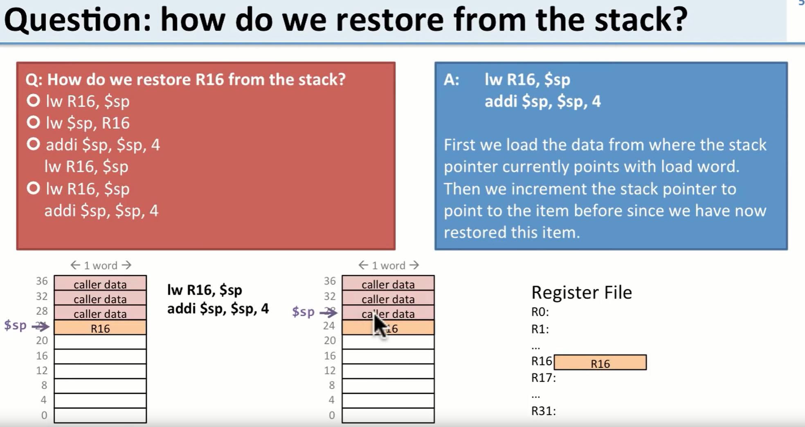


> 

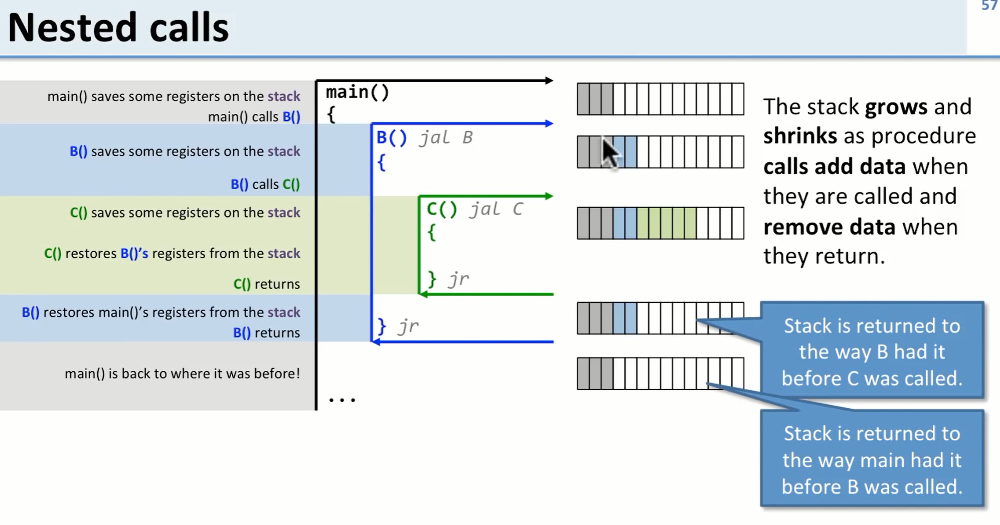


### 地址

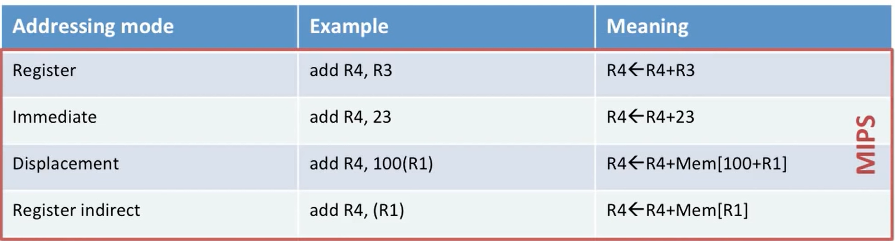


### 测试


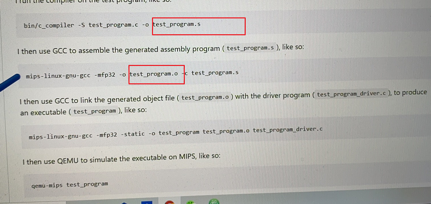


> mips 主要被分成五个部分:
>
> 1. Load and Store
> 2. ALU
> 3. Jump and Branch
> 4. Miscellaneous
> 5. Coprocessor


### 伪指令


#### ent

>  函数起点


#### data

>  数据段以 **.data**为开始标志


#### text

> 代码段以 **.text**为开始标志


### 寄存器Register GPR 通用寄存器

> 
>

#### SW : store word

>  sw  r1 r2 ; # 将r2给到r1


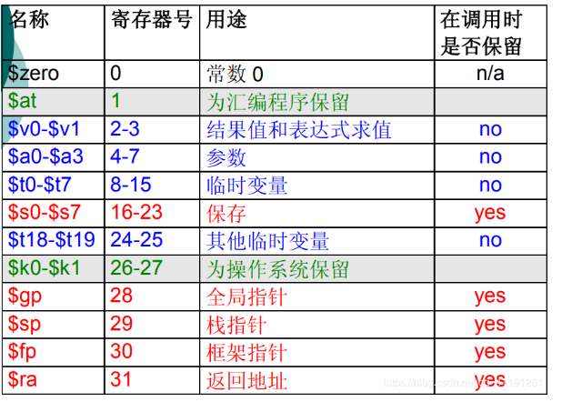


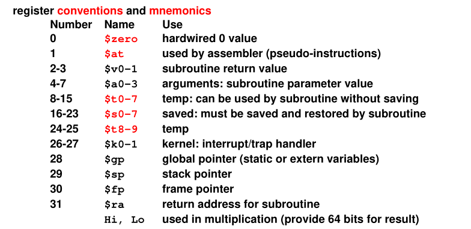


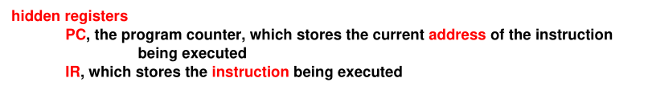


### Load and Store


​	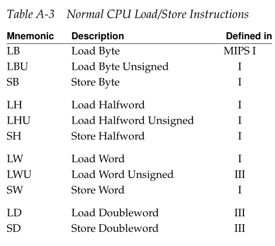


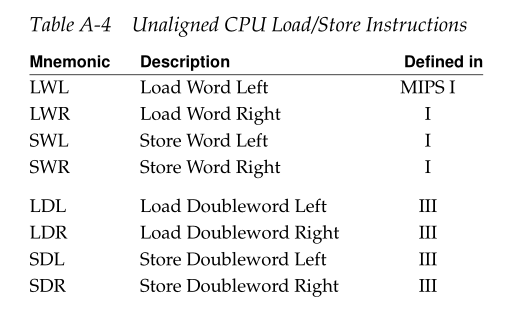


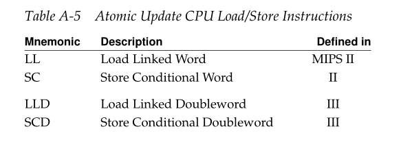


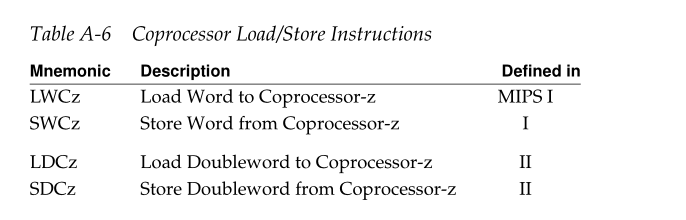


### ALU


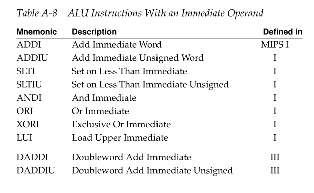


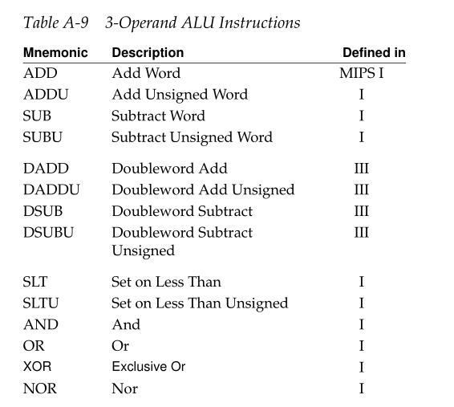


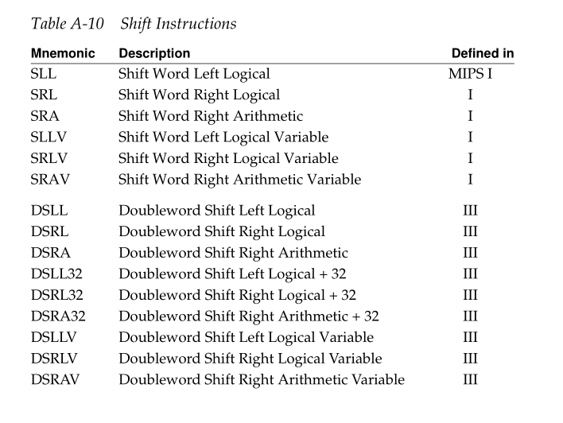


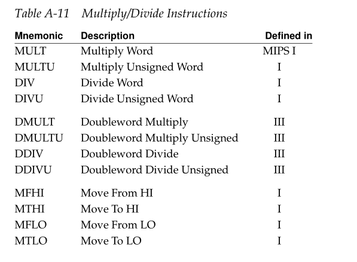


### Jump and Branch


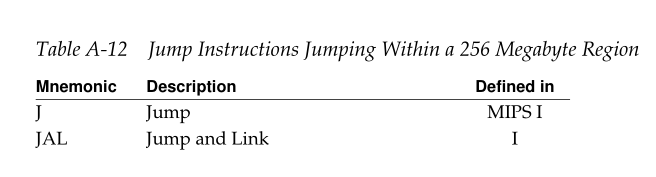


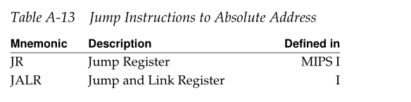


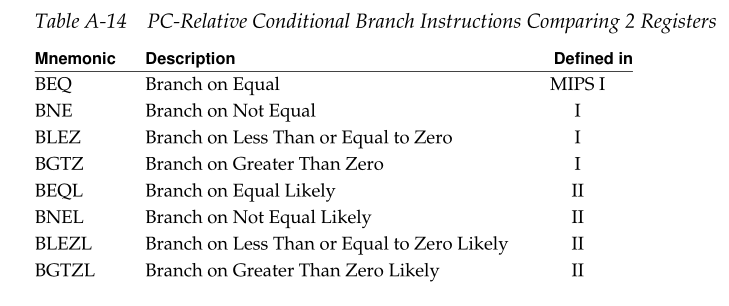


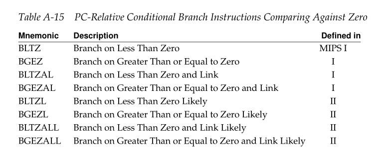


### Miscellaneous

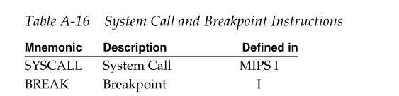


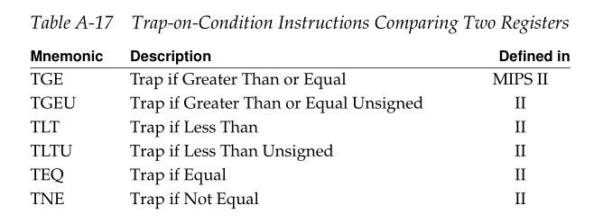


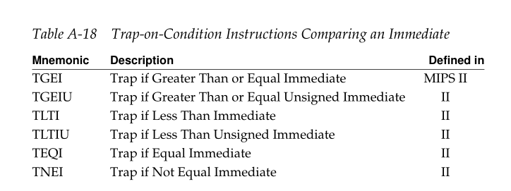


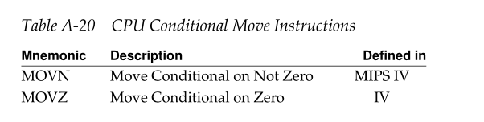


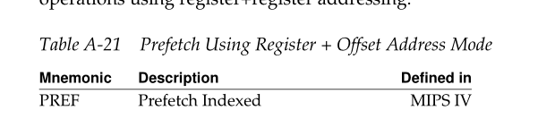


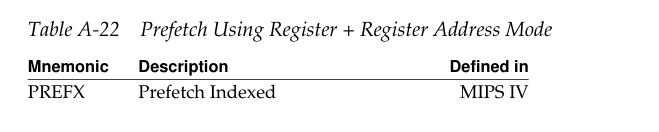


### Coprocessor

