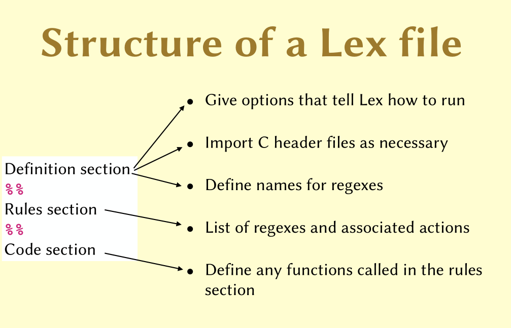
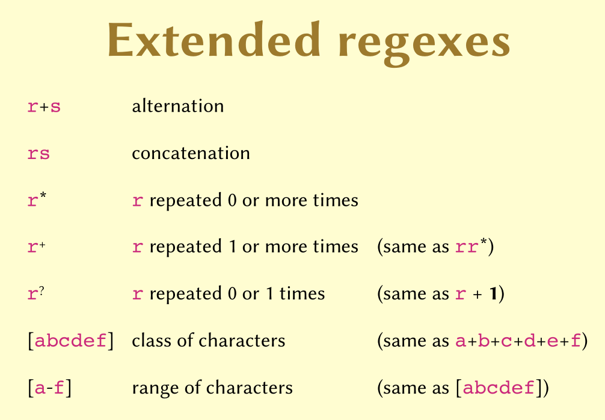
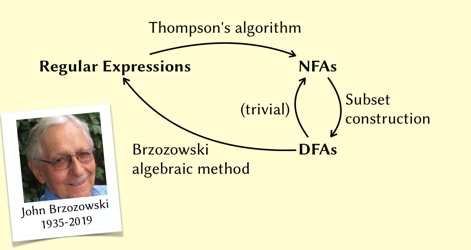
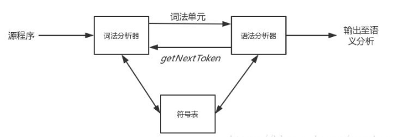
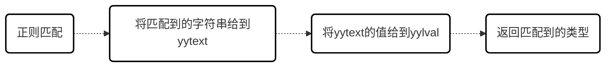
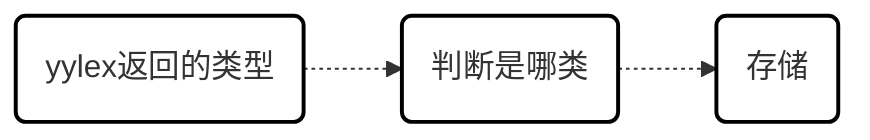
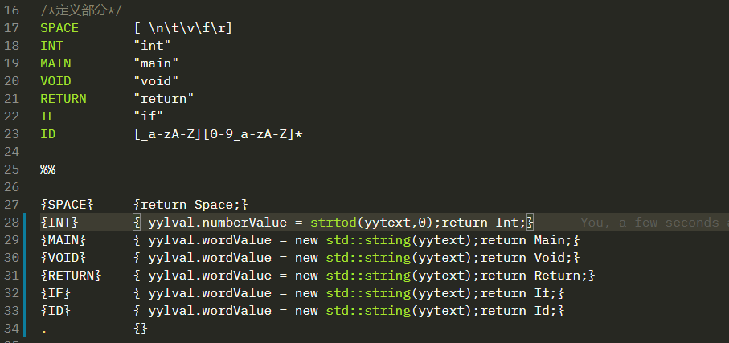
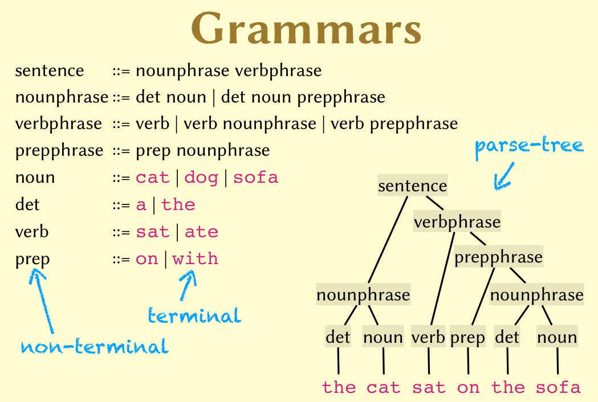

# C compiler


## 目标

+ 将c语言转成python语言
+ 将c语言转成mips语言


## 1. 词法阶段LA

> 利用flex词法解析器进行词法解析

### 1.1 工具

1. flex
2. re

#### 1.1.1 flex

+ flex

+ https://www.ibm.com/developerworks/cn/linux/sdk/lex/ 

  


#### 1.1.2. Regular Expressions





### 1.2 核心内容

+ Thompson's algorithem
+ Subset construction
+ Brzozowski algebraic method



### 1.3 与语法解析阶段的交互



> flex 通过每次call `yylex()` 函数进行**一个**词法单元的匹配,返回一个`token`,`yylval`这个全局变量保存这value属性值,`yytext`保存了匹配的词


### 1.4 input ＆ output

+ input: 源程序

+ output: :question: :ballot_box_with_check:

  > 具体是什么 还没有确定
  >
  > 解决: token<class,string>,eg:<Id,"foo">,<Op,"=">


### 1.5 主要工作

+ 写正则表达式


##### 开始

> 使用正则表达式测试工具编写RE 
>
>  https://www.sojson.com/regex/ 

##### c语言-class type

1. 标识符 `[_a-zA-Z][_a-zA-Z0-9]*`
2. 关键字 
3. 括号
4. 操作符
   1. 计算
      1. `+` 
      2. `-`
      3. `*`
      4. `/`
      5. `%`
      6. `++`
      7. `--`
   2. 比较
      1. `==`
      2. `>=`
      3. `<=`
      4. `>`
      5. `<`
   3. 连带
      1. `+=`
      2. `-=`
      3. `/=`
      4. `*=`
5. 注释 `/\*.*\*/`
6. 整数 `[-]?[1-9][0-9]*`
   1. 带后缀的 `[-]?[1-9][0-9]*[lLuU]*`
7. 浮点数 `[-]?[1-9]+[0-9]*\.[0-9]+`
   1. 带后缀的 `[-]?[1-9]+[0-9]*\.[0-9]+[f]?`
8. 字符 `['][.]+[']`
9. 字符串字面量 `".*"`
10. 按位操作
    1. `|`
    2. `&`
    3. `^`
    4. `~`
    5. `<<`
    6. `>>`
11. 特殊字符
    1. `->`
    2. `?`
    3. `;`
    4. `.`
    5. `,`
    6. `:`

> c_lexer.flex

```flex
%option noyywrap

%{

#include "../include/ast.hpp"
#include "c_parser.tab.hpp"  //包含bison生成的同名头文件

// This is to work around an irritating bug in Flex
// https://stackoverflow.com/questions/46213840/get-rid-of-warning-implicit-declaration-of-function-fileno-in-flex
extern "C" int fileno(FILE *stream);

%}
/* 声明部分 */

/*标识符*/
ID        [_a-zA-Z][_a-zA-Z0-9]*
/*空白字符*/
SPACE     [ \n\t]*
/*注释*/
COMMENT   /\*.*\*/
/*整型*/
INTEGER   [-]?[1-9][0-9]*[lLuU]*


/*浮点数*/
FLOAT     [-]?[1-9]+[0-9]*\.[0-9]+[f]?

HEX       0[xX][0-9a-fA-F]*
OCT       0[1-9][0-9]*
CHARACTOR L?['][.]+[']

STRING_L ".*"

OTHER     .

%%

"int"       {return T_INT;}
"if"        {return T_IF;}
"else"      {return T_ELSE;}
"while"     {return T_WHILE;}
"void"      {return T_VOID;}
"float"     {return T_FLOAT;}
"double"    {return T_DOUBLE;}
"auto"      {return T_AUTO;}
"break"     {return T_BREAK;}
"case"      {return T_CASE;}
"char"      {return T_CHAR;}
"const"     {return T_CONST;}
"continue"  {return T_CONTINUE;}
"default"   {return T_DEFUALT;}
"do"        {return T_DO;}
"enum"      {return T_ENUM;}
"extern"    {return T_EXTERN;}
"for"       {return T_FOR;}
"goto"      {return T_GOTO;}
"long"      {return T_LONG;}
"register"  {return T_REGISTER;}
"short"     {return T_SHORT;}
"signed"    {return T_SIGNED;}
"sizeof"    {return T_SIZEOF;}
"static"    {return T_STATIC;}
"struct"    {return T_STRUCT;}
"switch"    {return T_SWITCH;}
"typedef"   {return T_TYPEDEF;}
"union"     {return T_UNION;}
"unsigned"  {return T_UNSIGNED;}
"volatile"  {return T_VOLATILE;}
"inline"    {return T_INLINE;}


"+"         {return T_ADD;}
"-"         {return T_SUB;}
"*"         {return T_MUL;}
"/"         {return T_DIV;}
"%"         {return T_MOD;}
"++"        {return T_INC;}
"--"        {return T_DEC;}

"=="        {return T_EQ;}
">="        {return T_GE;}
"<="        {return T_LE;}
">"         {return T_GR;}
"<"         {return T_LS;}


"+="        {return T_ADD_ASSIGN;}
"-="        {return T_SUB_ASSIGN;}
"*="        {return T_MUL_ASSIGN;}
"/="        {return T_DIV_ASSIGN;}


"("         {return T_LPARENTHESIS;}
")"         {return T_RPARENTHESIS;}
"{"         {return T_LBRACE;}
"}"         {return T_RBRACE;}

"["         {return T_LSQUARE;}
"]"         {return T_RSQUARE;}

"|"         {return T_BOR;}
"&"         {return T_BAND;}
"^"         {return T_BXOR;}
"~"         {return T_NOT;}
"<<"        {return T_LSHIFT;}
">>"        {return T_RSHIFT;}

"->"        {return T_POINTER;}
"?"         {return T_QUESTION;}
";"         {return T_SEMICOLON;}
"."         {return T_SPOT;}
","         {return T_COMMA;}
":"         {return T_COLON;}


{COMMENT}   {/*do nothing*/}
{SPACE}     {/*do nothing*/}

{INTEGER}   {/*需要确定下是否带有后缀*/
              std::string temp = std::string(yytext);
              size_t size = temp.size();
              char c = temp[size-1];
              if(c=='l' || c=='L')
              {
                  char cc = temp[size-2];
                  if(cc=='u' || cc=='U')
                  {//ul uL Ul UL
                    yylval.u_long_value = stoi(temp.substr(0,size-2));
                    return T_ULONG;
                  }
                  //l or L
                  yylval.long_int_value = stoi(temp.substr(0,size-1));
                  return T_LONGINT;

              }
              if(c=='u' || c=='U')
              {
                  
                  yylval.u_int_value = stoi(temp.substr(0,size-1));
                  return T_UINT;
              }

              yylval.intValue = stoi(yytext);return T_INTEGER;
              }
{FLOAT}     {/*需要确定下是否带有后缀*/
              //去掉后缀
              std::string temp = std::string(yytext);
              size_t size = temp.size();
              char c = temp[size-1];
              if(!isdigit(c))
              {
                  yylval.floatValue = stoi(temp.substr(0,size-1));
                  return T_FLOAT;
              }
              yylval.floatValue = stod(yytext);return T_FLOAT;}

{STRING_L}  {yylval.string = new std::string(yytext); return T_STRING_L;}
{ID}        {yylval.string = new std::string(yytext);return T_ID; }
{OTHER}     {yyerror(yytext);}

%%

void yyerror (char const *s)
{
  fprintf (stderr, "Parse error : %s\n", s);
  exit(1);
}
```


#### 1.6 工作流

##### 匹配阶段



##### 处理阶段






## 2. 语法解析阶段Parsing

### 工具

#### Yacc

+  https://www.ibm.com/developerworks/cn/linux/sdk/lex/ 


### 语法树

+ 终结符terminal
+ 非终结符 non-terminal



### 主要工作

+ 编写产生式


## 3. 代码生成阶段 Code generation

